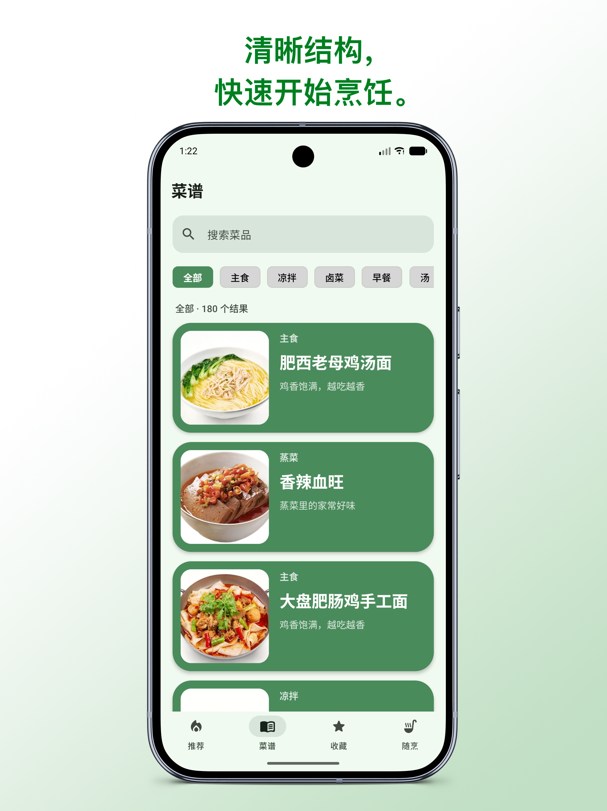
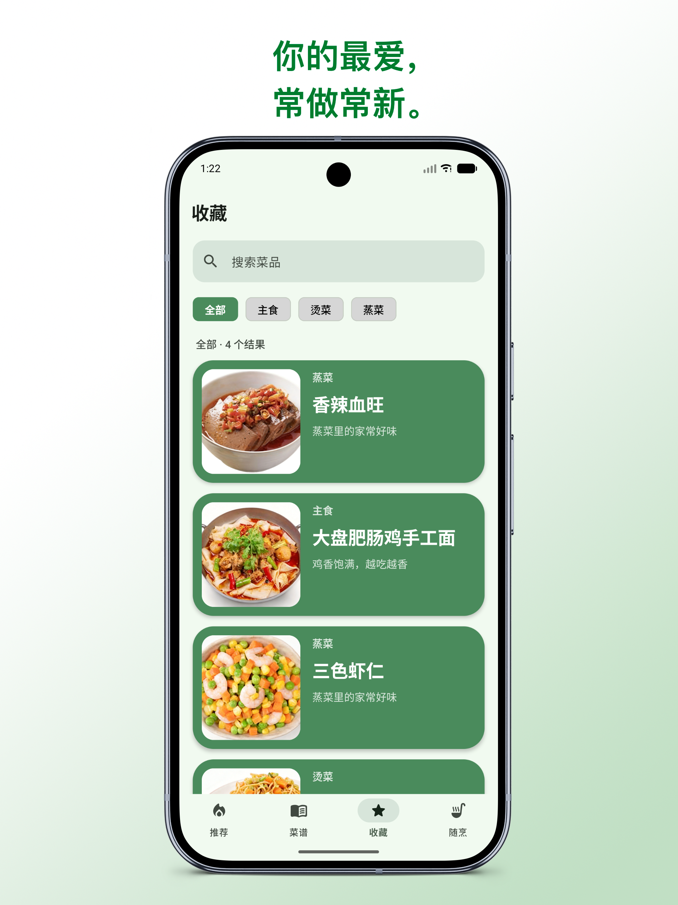
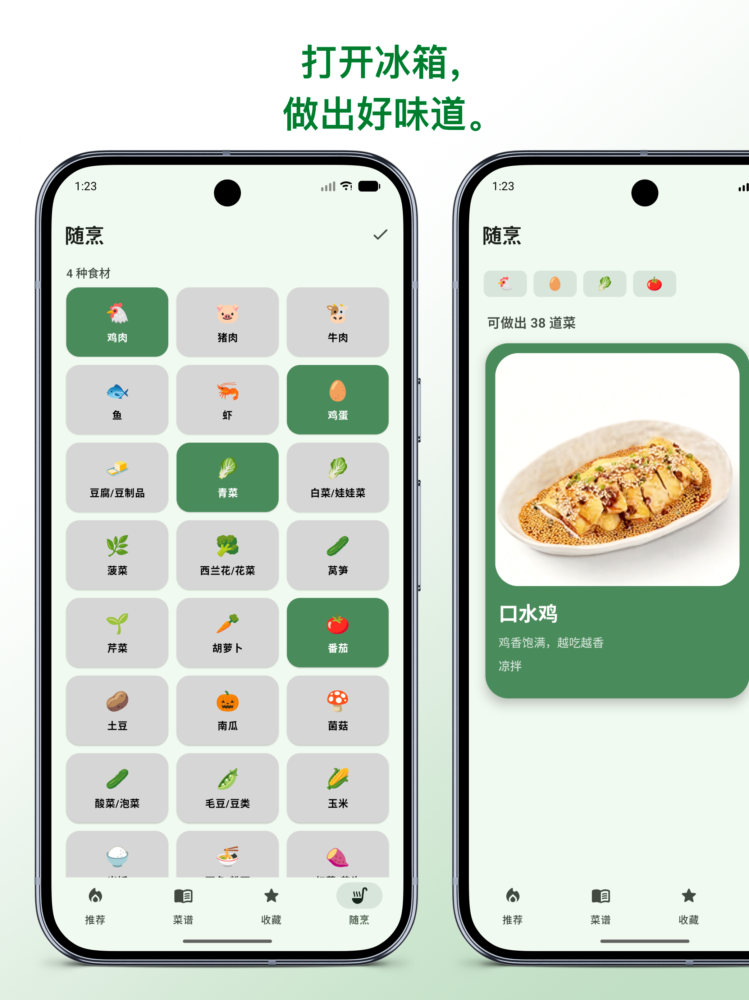

# 馋香鸡 安卓版

把厨房变简单，从今天开始做一顿。

馋香鸡 安卓版 是一款专注“做饭过程”的极简离线菜谱工具。它把每日推荐、分类检索、清晰步骤、收藏整理和随烹推荐放进一个干净的界面里，帮助你更轻松地走进厨房。

## 功能亮点

- 每日推荐：减少“今天吃什么”的纠结。
- 菜谱浏览：分类、搜索、详情和步骤一目了然。
- 收藏整理：常做、爱吃的菜随时找回。
- 随烹推荐：根据已有食材匹配可做菜品。
- 桌面小组件：把一道菜直接放到桌面上。

## 预览

  
  
  

  
  

## 设计理念

馋香鸡关注的不是“菜有多少”，而是“做饭是否更轻松”。应用保持轻量、清爽、少打扰，让注意力留给食材、步骤和灶台前的当下。
